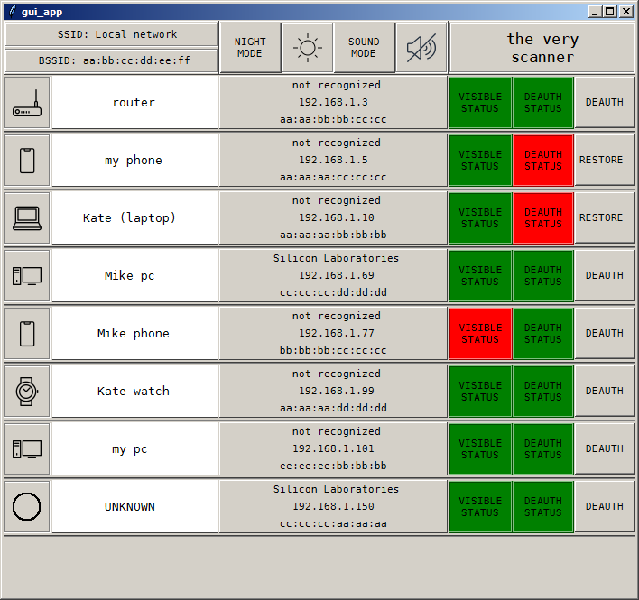

clients_scanner
===========
Local network clients scanner, with possibility of deauthentication

Info
===========
Application shows local network devices. Stores known devices in client.ini file. Allows us, to perform deauthentication.

Install
===========

.. code-block:: python

    pip install clients_scanner

Usage
===========

.. code-block:: python

    from clients_scanner import scanner

    scanner()
    # then just press enter, and wait for gui app to start running
    # due to slow import of scapy, it could take few seconds

Example application view
===========

Todo
===========
26.05.2020, todo:

    - fix widgets positions (padx, pady, etc)

    - add frame for main rows

    - add scrollbar for frame with rows

    - make "night-mode-button" functional

    - consider replacing topbar label (images) and buttons, to buttons with images

    - add entries for timings in topbar (minimal time for visible, searching time)

    - think of scapy slow import

    - fix gui (with changes above), to work on linux

    - log users activity, to file, in the following format, line by line:
    
      <current time>, <client mac>, <True/False>

    - think of scanning for open ports

    - make info about device (vendor, ip, mac) possible to copy

    - define device type, by vendor, if not specified by user

    - add bar with info about columns:
    
      DEVICE_TYPE, NAME, INFO, VISIBLE, DEAUTH, DEAUTH_CONTROLL

    - think of early warning system, if device is seen

    - consider splitting main class, into three independend (gui, search_clients, deauth)

    - provide handle for searching gateway_ip and gateway_mac (independend of interface)
    
    - store config files in package files directory
