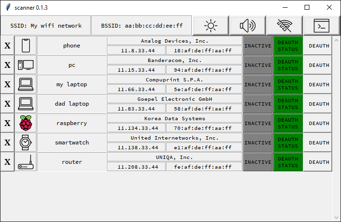

clients_scanner
======================
Local network clients scanner with deauth feature

Info
======================
- while creating app I was inspired by Android Fing application
- application shows local network devices
- discovered devices are stored in clients.json file under home directory
- application allow to perform deauthentication(disconnecting devices connected over WiFi)
- deauthentication bases on: https://github.com/roglew/wifikill
- icons by Icons8: https://icons8.com/
- sounds from: https://mixkit.co/

Install
======================

.. code-block:: python

    pip install clients_scanner

or

.. code-block:: bash

    pip install git+https://github.com/streanger/clients_scanner.git

**Important: scapy uses `Npcap` or `Winpcap` on Windows and `libpcap` on Linux. Please install needed package manually**

Windows:
.. code-block:: bash

    # https://npcap.com/
    # https://www.winpcap.org/install/
    choco install nmap -y

Linux
.. code-block:: bash

    sudo apt-get install git libpcap-dev

Usage
======================

from python

.. code-block:: python

    from clients_scanner import scanner
    scanner()

from commandline

.. code-block:: bash

    scanner

Example view
======================

Keywords and icons
======================
- router -> .. image:: clients_scanner/images/router.png
- laptop -> .. image:: clients_scanner/images/laptop.png

Changelog
======================
- v. 0.1.3
 - reshaped gui
 - night mode
 - scan on/off mode
 - debug mode
 - "removing clients" feature
 - scrollable area
 - more friendly sound
 - config files in user home directory

- v. 0.1.0 - 0.1.1
 - gui with limited rows number
 - deauth feature
